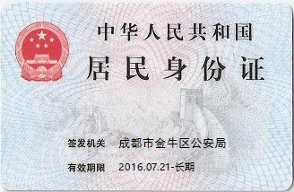
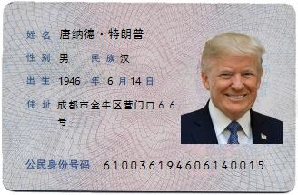

# Yu.Toolkit 工具包
This is a small c sharp toolkit.

一个简单的c#工具包

## Yu.Toolkit.RegionCode 行政区划代码

> 行政区划代码 http://www.mca.gov.cn/article/sj/xzqh/1980/   1980 - 2020

### 1.0.5

1. Dependency update 依赖关系更新

### 1.0.4

1. Add support version 添加支持版本

### 1.0.3

1. Reference dependency 引用依赖

### 1.0.2

1. Add update 添加更新
2. Update the area and add the last used year  更新区域并添加上次使用的年份

### 1.0.1

1. Automatically publish Nuget packages 自动发布Nuget包

### 1.0.0

- property 属性
  - Regions 行政区划代码
  - Provinces 省
  - Cities 城市
  - Areas 区域
- method 方法
  - ```RegionDto GetRegionByCode(string code)```
  - ```RegionDto GetRegionByName(string name)``` 
  - ```string GetRegionNameByCode(string code)``` 
  - ```string GetRegionCodeByName(string name)  ```
  - ```RegionDto GetProvinceByCode(string code) ``` 
  - ```RegionDto GetProvinceByName(string name)``` 
  - ```GetProvinceNameByCode(string code) ```
  - ```GetProvinceCodeByName(string name)``` 
  - ```RegionDto GetCityByCode(string code)``` 
  - ```string GetCityNameByCode(string code)``` 
  - ```string GetCityCodeByName(string name)``` 
  - ```RegionDto GetAreaByCode(string code)``` 
  - ```RegionDto GetAreaByName(string name)  ``` 
  - ```string GetAreaNameByCode(string code)``` 
  - ```string GetAreaCodeByName(string name)``` 
  - ```List<RegionDto> GetCitiesByProvinceCode(string code)``` 
  - ```List<RegionDto> GetAreasByCityCode(string code)``` 

## Yu.Toolkit.UnifiedSocialCreditIdentifier 社会统一信用代码校验与生成

> 社会统一信用代码 http://c.gb688.cn/bzgk/gb/showGb?type=online&hcno=24691C25985C1073D3A7C85629378AC0

### 1.0.5

1. Dependency update 依赖关系更新

### 1.0.4

1. Add support version 添加支持版本

### 1.0.3

1. Reference dependency 引用依赖

### 1.0.2

1. Add parse method 添加解析方法

### 1.0.1

1. Automatically publish Nuget packages 自动发布Nuget包

### 1.0.0

* property 属性
  * RegistrationManagementDepartmentCodeList 签发机构
* method 方法
  * ```string GetCheckCode(string str)``` 获取第十八位校验码
  * ``` void CheckOrganizationCode(string code)``` 检测签发机构是否正确
  * ```string Gengenerate(string[] organizationCodes = null, string regionCode = "")``` 生成社会统一信用代码
  * ```void Verification(string code)``` 验证社会统一信用代码是否符合规范

## Yu.Toolkit.CitizenIdentificationNumber 身份证号码校验与生成

> 公民身份号码  http://c.gb688.cn/bzgk/gb/showGb?type=online&hcno=080D6FBF2BB468F9007657F26D60013E

### 1.0.5

1. Dependency update 依赖关系更新

### 1.0.4

1. Add support version 添加支持版本

### 1.0.3

1. Reference dependency 引用依赖

### 1.0.2

1. Add parse method 添加解析方法

### 1.0.1

1. Automatically publish Nuget packages 自动发布Nuget包

### 1.0.0

* method 方法
  * ```string GetCheckCode(string str)``` 获取第十八位校验码
  * ```string Gengenerate(string regionCode = "", string dateBirth = "", CitizenIdentificationNumberGenderEnum gender = CitizenIdentificationNumberGenderEnum.Male | CitizenIdentificationNumberGenderEnum.Female)``` 随机生成身份证号码
  * ```void Verification(string code)``` 验证身份证号码是否符合规范 

## Yu.Toolkit.CitizenIdentificationImage 身份证图像生成

### 1.0.1

1. Dependency update 依赖关系更新

### 1.0.0

* method 方法
  * ```Bitmap GengenerateFront(string issuingAuthority, string validPeriod = "")``` 生成身份证正面
  * ```Bitmap GengenerateBack(string name, string ethnic, string address, string citizenIdentificationNumber, Image avatarPhoto = null)``` 生成身份证反面
* preview 预览
  * 
  * 


## Yu.Toolkit.NameGenerator  名称生成器

### 1.0.0

method 方法

* ```string Generate(NameGeneratorGenderEnum gender = NameGeneratorGenderEnum.Male | NameGeneratorGenderEnum.Female)``` 生成名字 

